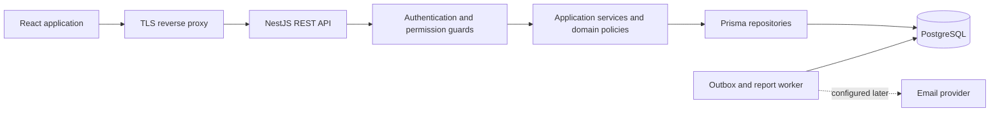

# Architecture

## Design

Use a modular monolith: a React browser client, a versioned NestJS API, PostgreSQL, and a background worker for notification delivery and report jobs. This keeps workflow transactions within one database while maintaining module boundaries.



Controllers validate DTOs and map HTTP responses. Services coordinate transactions. Domain policies implement authorization scope, workflow, workload eligibility, and payment calculations. Repositories accept mandatory scope constraints. API response DTOs explicitly allowlist fields.

## Backend modules

Auth, Users, Roles, Permissions, Faculties, Departments, Courses, Academic Years, Semesters, Lecturer Workloads, Claims, Claim Items, Claim Approvals, Finance, Payments, Reports, Notifications, Audit Logs, Settings, and shared infrastructure.

Claims owns lifecycle changes; Finance invokes that policy in the payment transaction. Audit and outbox insertion are available from the foundation phase, even though their full interfaces arrive later. Reports are read-only consumers of scoped data. No module writes another module's status field directly.

## Recommended folder structure

```text
/
  README.md
  docs/
  apps/
    web/
      src/
        app/                 # router, providers, application shell
        features/            # auth, claims, review, finance, admin, reports
        components/          # reusable accessible UI
        services/            # typed REST client
        styles/              # tokens, global styles, CSS modules
        test/
    api/
      src/
        modules/             # feature modules, controllers, services, DTOs
        domain/              # workflow and calculation policies
        common/              # guards, errors, validation, request context
        database/            # Prisma and transaction helpers
        jobs/                # durable outbox and exports
      prisma/
        schema.prisma
        migrations/
        seed.ts
      test/
  packages/
    contracts/               # public DTO types; no DB models or secrets
  tests/e2e/
  infra/docker/
  .env.example
```

This is the target structure. React and NestJS foundations, Prisma models, and development scripts already exist; domain modules, workers, migrations, tests, and deployment infrastructure remain incomplete. Retain existing module boundaries unless a concrete feature needs separation. Public DTO types must not expose Prisma models; introduce a shared package only when actual consumers justify it. See [Implementation readiness](IMPLEMENTATION_READINESS.md) for decisions that reconcile this target with existing code.

## Transaction and concurrency boundary

For each mutation: authenticate, load current permissions, determine scope, validate DTO, start transaction, load scoped record and configuration, enforce state/version, calculate, conditionally update version, append decision/history/audit/outbox, commit. A failed precondition returns `409 Conflict`. Retry only operations known to be idempotent; never replay a financial mutation blindly.

Use idempotency keys for submission and finance mutations, uniquely bound to actor, operation and request hash. Repeating a key with a different payload fails. Database uniqueness remains necessary even when different keys are used.

## Deployment boundary

Prefer same-origin frontend/API routing. PostgreSQL is private; only API/worker services access it. Separate migration privileges from runtime privileges. Workers use the same domain policies and least-privilege access. External payment execution is outside the initial scope: the system records payments processed through the university's approved process.
