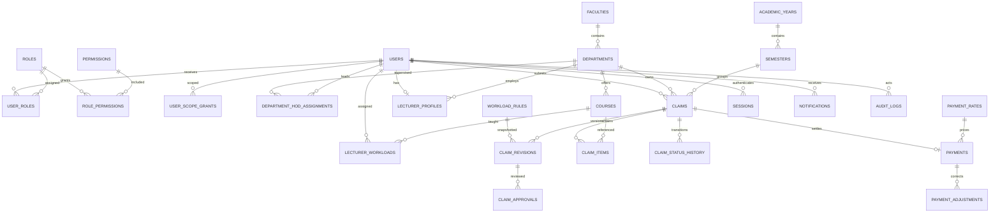

# Database design and ERD

This is the target logical PostgreSQL design, not an executed migration. A partial Prisma schema exists; migrations, SQL constraints, and missing entities still need implementation and verification. The target-to-code reconciliation is recorded in [Implementation readiness](IMPLEMENTATION_READINESS.md). Institution-dependent constraints are called out in the decision register.

## Conventions

Use UUID primary keys except composite join-table keys. Mutable entities have `created_at`, `updated_at`; events have immutable `created_at`. Use `timestamptz` for events and `date` for teaching/payment calendar dates. Claims and payments carry integer `version` fields. Foreign keys restrict deletion of referenced business history.

Use `numeric(12,4)` for hours, `numeric(19,6)` for rates, and provisionally `numeric(19,4)` for stored amounts with currency-specific final rounding. Confirm bounds and currency rules before implementation. JSON snapshots preserve evidence; they do not replace normalized operational relationships.

## Tables and relationships

| Table | Main fields and constraints |
| --- | --- |
| users | id, normalized email UNIQUE, staff_id UNIQUE, password_hash, display_name, active |
| roles | id, code UNIQUE, name, active |
| permissions | id, code UNIQUE, description; executable permission catalog managed by code |
| role_permissions | role_id + permission_id composite PK |
| user_roles | user_id + role_id composite PK |
| user_scope_grants | id, user_id, role_id, scope_kind, faculty_id/department_id; check matches kind; explicit global scope |
| faculties | id, code UNIQUE, name, active |
| departments | id, faculty_id FK, code UNIQUE, name, active |
| department_hod_assignments | id, department_id, user_id, valid_from, valid_to; scope is explicitly assigned |
| courses | id, department_id, code UNIQUE, title, credit_hours nullable, active |
| academic_years | id, label UNIQUE, starts_on, ends_on, active |
| semesters | id, academic_year_id, name, starts_on, ends_on, active; UNIQUE(year, name) |
| lecturer_profiles | user_id PK/FK, department_id, employment_type, category, active |
| workload_rules | id, category/employment scope, period/effective dates, expected_weekly_hours, policy_version, active |
| lecturer_workloads | id, lecturer_id, semester_id, course_id, teaching dates, weekly_hours, weeks, assignment reference |
| claims | id, reference UNIQUE, lecturer_id, department_id, faculty_id, semester_id, claim_type, status, version, submitted_at, calculation snapshot |
| claim_items | id, claim_id, course_id, workload_id nullable, starts_on, ends_on, weekly_hours, weeks, total_hours, remarks, course snapshot |
| claim_revisions | id, claim_id, revision_no, immutable submitted content/configuration snapshot; UNIQUE(claim, revision_no) |
| claim_approvals | id, claim_id, revision_id, reviewer_id, stage, decision, reason, created_at |
| claim_status_history | id, claim_id, revision_id nullable, from_status, to_status, actor_id, reason, request_id, created_at |
| payment_rates | id, category, employment_type, semester_id nullable, academic_year_id nullable, effective dates, hourly_rate, currency, policy_version, active |
| payments | id, claim_id UNIQUE, revision_id, rate_id, eligible_hours, rate_snapshot, gross_amount, payable_amount, currency, status, reference, paid_on, notes, version |
| payment_adjustments | id, payment_id, proposed correction details, reason, actor_id, created_at; future controlled correction workflow |
| notifications | id, recipient_id, event_id, claim_id nullable, message, read_at, created_at; UNIQUE(recipient,event) |
| outbox_events | id, event_type, aggregate_id, payload, attempts, available_at, delivered_at |
| audit_logs | id, actor_id nullable, role_snapshot, action, entity_type, entity_id, before/after redacted JSON, request_id, IP nullable, metadata, created_at |
| sessions | id, user_id, token_family_id, refresh_token_hash UNIQUE, expires_at, revoked_at, replaced_by_id nullable |
| access_reset_tokens | id, user_id, token_hash UNIQUE, expires_at, consumed_at |
| idempotency_records | id, actor_id, operation, key, request_hash, result reference, expires_at; UNIQUE(actor,operation,key) |
| system_settings | key PK, typed value, version, changed_by; no plaintext credentials |
| report_exports | id, requester_id, report_type, filters, state, storage_key, expires_at; scope rechecked at retrieval |

Claims derive academic year through semester to avoid inconsistent year/semester pairs. Department/faculty and course labels are captured at submission so later organizational changes cannot rewrite historical reporting. Scope uses the claim's recorded ownership; reassignment requires a separate audited policy.

## ERD

## Integrity and indexes

- Check nonnegative hours, rates and amounts; require positive weeks/hours on submission; require starts_on <= ends_on. Validate dates against the semester and institution-approved teaching calendar.
- Rules and rates are versioned. Reject ambiguous overlapping applicability; do not silently pick the newest matching rate.
- Require paid reference/date for completed payments. One payment record per claim is the proposed initial model; installments require a revised allocation model.
- Enforce duplicate teaching coverage at submission under transaction locking and a database constraint matching the confirmed policy. The exact key (course, class/section, period, teaching interval) is unresolved; a simplistic course-per-semester unique key could reject legitimate teaching.
- Query-driven index candidates: claims(lecturer_id, created_at, id), claims(department_id, status, submitted_at, id), claims(status, submitted_at, id), claims(semester_id, department_id, status), claim_items(claim_id), history(claim_id, created_at), approvals(claim_id, revision_id), notifications(recipient_id, read_at, created_at), audit_logs(entity_type, entity_id, created_at), audit_logs(actor_id, created_at).
- Index referencing FK columns where required by joins/deletion checks, reusing composite leading columns; avoid redundant indexes. Verify actual plans and cardinalities during hardening.
- Runtime database privileges deny audit update/delete; submitted snapshots are append-only. Payment completion is guarded transactionally. Administrative deactivation does not cascade-delete financial records.
