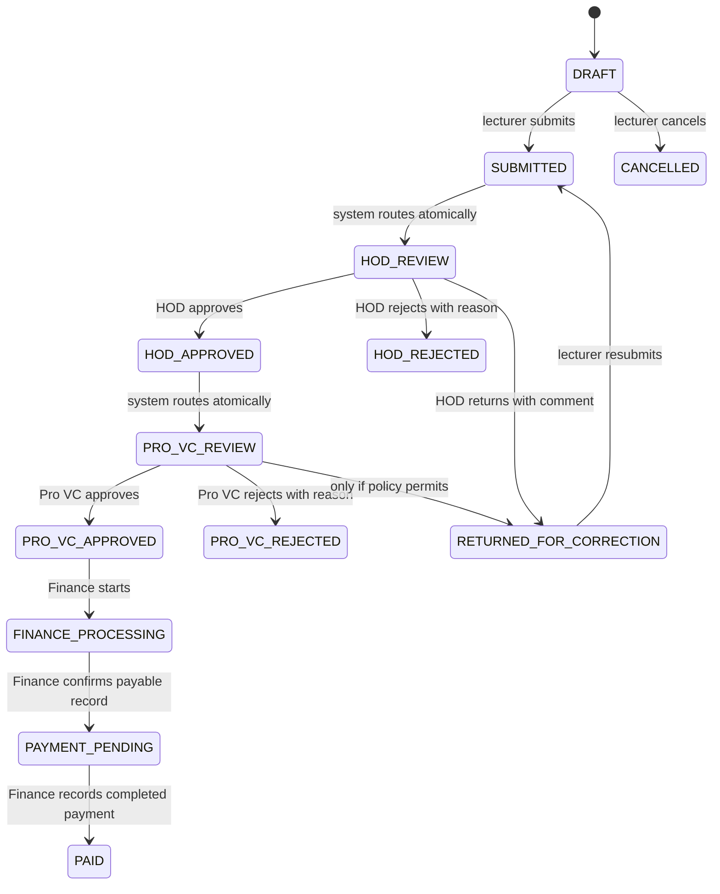

# Claim workflow and calculations

## State machine

`SUBMITTED` and `HOD_APPROVED` are recorded history milestones within the same transaction as routing to `HOD_REVIEW` and `PRO_VC_REVIEW`. Clients see the final queue state after commit. `PRO_VC_APPROVED` remains a stable state until Finance explicitly begins processing.

## Transition requirements

| Action | Preconditions and effects |
| --- | --- |
| Save/edit draft | Owner, DRAFT or RETURNED_FOR_CORRECTION, expected version; server recalculates |
| Submit/resubmit | Valid active courses/period, positive inputs, no duplicate coverage, applicable workload policy; immutable revision; HOD notification |
| HOD approve | Department scope, HOD_REVIEW, current revision/version; approval event; Pro VC notification |
| HOD reject/return | Same scope/state checks; mandatory reason/comment; lecturer notification |
| Pro VC approve/reject | Office scope, PRO_VC_REVIEW, valid HOD decision on same revision; rejection reason required |
| Pro VC return | Same checks plus configured policy and comment; resubmission restarts HOD review |
| Finance start | PRO_VC_APPROVED, finance scope, current revision's required approvals |
| Mark pending | FINANCE_PROCESSING; valid unambiguous rate, reproducible amount and payment data; unique payment record |
| Mark paid | PAYMENT_PENDING; reference and payment date; expected claim/payment versions; immutable finalized values |
| Cancel | Owner DRAFT only by default; retain history |

Every action writes status history, audit evidence, and applicable outbox events. Rejections are terminal until an explicit resubmission policy is approved. No generic status-update endpoint exists. Resubmission creates a new revision; old decisions remain historical and cannot authorize that revision.

PAID and CANCELLED are terminal. Corrections to paid records require a separate append-only adjustment process; no endpoint for that process is enabled until its authorization/accounting policy is defined.

## Calculations

- Each item: `total_hours = weekly_hours × number_of_weeks` using decimal arithmetic on the server; browser calculates an informational preview.
- Weekly overload: `max(actual_weekly_hours - expected_weekly_hours, 0)`.
- Period overload: sum eligible overload across actual teaching weeks. Do not subtract weekly expected hours from a semester total. Do not sum per-course overload: aggregate the lecturer's full workload first.
- Part-time payable hours derive from validated teaching coverage and the configured eligibility policy.
- Payable gross amount: `eligible_hours × applicable_hourly_rate`. Amounts are serialized as decimal strings and rounded under an explicit currency policy.

All workload sources, eligible-hour allocations across claims, effective rules, rate, currency, rounding and calculation version are captured in snapshots. Claimed courses alone may not describe the lecturer's normal workload. Submission/payment progression must be blocked when required configuration or workload evidence is missing; missing rates must never become a zero amount silently.

Different course durations, partial weeks, team teaching, overlapping claims, deductions, and rate changes mid-period require confirmed rules. Until supplied, the engine must reject unsupported ambiguity with actionable validation. Finance cannot silently override a computed amount; any permitted override requires a separately defined permission, reason and audit policy.
